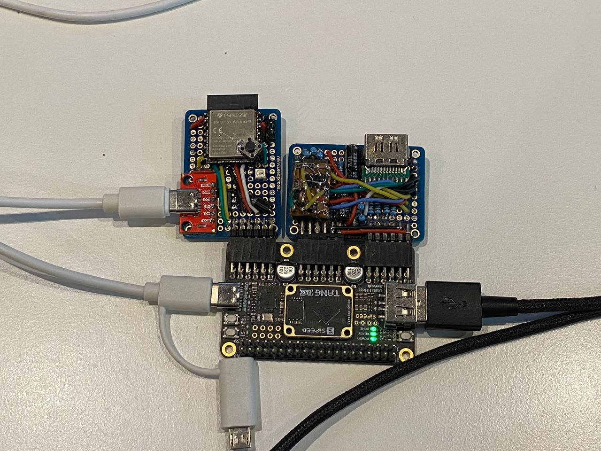
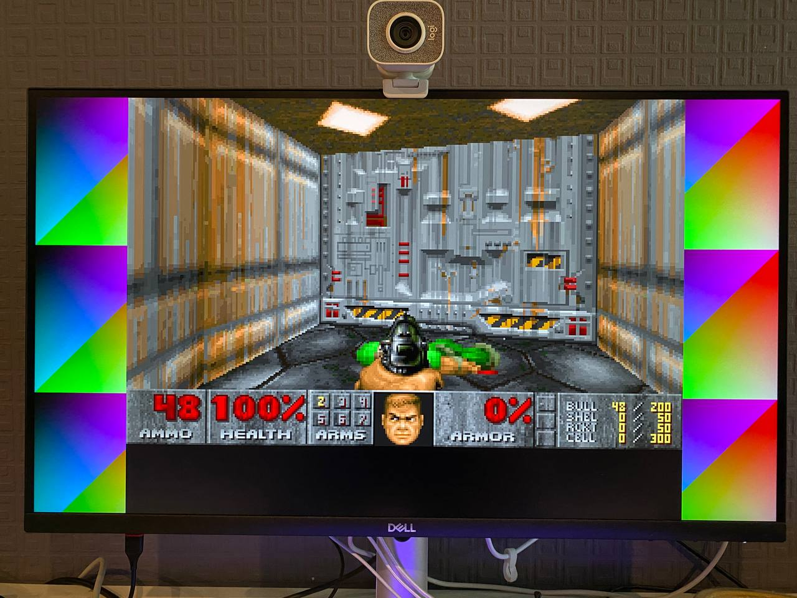

# tang-primer-25k-spi-io

## Intro
Main goal of this project was to learn about FPGA programming through writing something marginally useful.

A reasonably priced (~35$) [Sipeed Tang Primer 25K](https://wiki.sipeed.com/tang25k) enthusiast-level board caught my eye. 
It is built around Gowin GW5A-25 FPGA chip and has plenty of resources for tinkering around with, including 1 megabit of BRAM, ~23K LEs and 6 PLLs.

After writing my first blinky, impressed by RP2040 outputting VGA or even DVI video using PIO, i realized, that now i have something much better than PIO...

## SPI IO: HDMI and USB HID
The project consists of two parts:

#### Tang Primer 25K board
* HDMI output: GW5A-25 can do 1080p DVI (no audio) or 720p HDMI (with audio) with no issues
* USB HID handling: since the board already has a type-A USB port, i decided to offload this job to the FPGA too
* Frame and audio buffers: without a 40-pin SDRAM module, 1 megabit of on-chip BRAM is enough for one 320*240@256 color framebuffer, 24 bit palette and about 1 frame of audio
* Has Quad SPI slave interface with two CS lines: 'GPU' for HDMI and 'IO' for USB HID

#### ESP32-S3 DIY PMOD
* Has a lot of conventional computing power, two cores, high clock, FPU and more
* Has up to 32 megabytes of flash and 8/16 megabytes of PSRAM
* Acts as an SPI master with a simple driver layer handling FPGA polling, vsync, audio buffering etc.
* Driver provides simple interface for frame presentation, synchronized audio and handling HID events



## Specs
Combining FPGA based GPU-peripheral and an actual CPU together results in a something resembling a DOS-era PC:
* The only video mode is 320*240@256 color palette, integer scaled and pillarboxed to 720p@60 HDMI
* 16 bit 48 KHz stereo sound through HDMI
* Quad SPI communication between MCU and FPGA at 80 MHz, giving plenty of bandwidth for 320*240@60hz
* USB HID: uses small RISC-V softcore with 16 kilobytes of memory to handle USB1.1 mice, keyboards, combined mouse-keyboard devices and hubs

## SPI command reference
Just check the **fpga_driver_low** [code](./src/esp32s3/esp-idf-components/fpga_driver_low). 
ESP32-S3 hardware SPI master peripheral is used, i just had to tweak dummy cycle count and latency compensation a bit. 

## Hardware
Disregard my homebrew HDMI PMOD, at some point i was thinking of decoding HDMI ARC - for just HDMI output [Sipeed DVI(HDMI) PMOD](https://wiki.sipeed.com/hardware/en/tang/tang-PMOD/FPGA_PMOD.html#PMOD_DVI) is fine.

ESP32-S3 PMOD just wires out 7 ESP32-S3 GPIOs: 4 bidirectional Quad SPI data lines, SCK and two CS lines. 

Any 7 pins can be used for this using SPI over GPIO matrix.
Works fine, although wire length can be a problem at 80 MHz if regular devkit and dupont jumpers to FPGA are used, in this case 40 or even 20 MHz should still be okay. 
I used bare [ESP32-S3-WROOM module](./doc/pmod_esp32s3_front.jpg) on a perfboard.

## Software

### FPGA
Everything is inside a single Gowin EDA project, synthesize and program according to [Sipeed instructions](https://wiki.sipeed.com/hardware/en/tang/tang-primer-25k/primer-25k.html#Related-Questions). Plain Gowin EDA installation works fine for me.

Besides SystemVerilog and Verilog code, it contains RISC-V code for USB handling, located at [.../usb_host/ucmem](./src/fpga/spi_io_bridge/src/usb_host/ucmem). 
Build output **mem.hex** that is embedded into the FPGA bitstream is included, so unless you modify the source no additional steps required.

### ESP32-S3
There is a common component folder [esp-idf-components](./src/esp32s3/esp-idf-components) containing **fpga_driver,** which is the main FPGA interface wrapper. 
The driver runs pinned to core 0 as a high priority task, so core 1 can be used solely for the 'user' app.

If writing a new app, just add the component folder to esp-idf search path in top-level CMakeLists.txt:
```
list(APPEND EXTRA_COMPONENT_DIRS "${CMAKE_CURRENT_SOURCE_DIR}/../esp-idf-components")
```
Then if explicit esp-idf component is required it can be referenced this way:
```
idf_component_register(SRCS "abc.c" 
                    INCLUDE_DIRS "."
                    REQUIRES fpga_driver)
```


Also there is one specific test app included to prove that this indeed is a computer. Obviously it is...

## Chocolate Doom port



This is a pretty straightforward port of Chocolate Doom 3.1.0, with SDL dependencies replaced with **fpga_driver** and RTOS stuff.

Shareware DOOM1.WAD fits into ESP32-S3 N8R2 module (8MB flash 2MB PSRAM), while DOOM2.WAD is >14MB itself, so i had to buy N32R8V to test it.

**kilograham** has [proven](https://github.com/kilograham/rp2040-doom) that optimized Doom 2 can run on a 264KB RAM RP2040, but my port is mostly just vanilla Chocolate Doom:

* Only 'Doom' Chocolate Doom part is built
* Has a small FATFS partition for saves and configs
* Supports USB mouse and keyboard
* Stable 35 (i believe) fps
* Shareware Doom 1 runs on a common N8R2 module
* Uses vanilla WAD files, although stored and accessed as a raw data partition through **mmap** utilizing uncached lump access: with lump caching even on 8 megs of PSRAM Doom 2 is unable to load past the splashcreen!
* Z_Zone memory disabled in favor of Z_Native
* Chocolate Doom's OPL emulator is replaced with DOSBox's Woody OPL, however i still had to run it at half the samplerate (24KHz)
* SFX with 'integer resampling'
* Network not implemented, but given ESP32-S3 already has Wi-Fi and lwip stack, this should not be a problem

### Doom demo (YouTube)
[](https://www.youtube.com/watch?v=MOvzoBieVqo)

## Credits
### Gowin GW5A-25 FPGA side
* HDMI video and audio encoder: [hdmi](https://github.com/hdl-util/hdmi/) by [Sameer Puri](https://github.com/sameer), dual-licensed under MIT and Apache 2.0
* USB HID mouse and keyboard handling: based on [usb_host](https://github.com/emard/usb_host) by [emard](https://github.com/emard), includes BSD licensed code

### ESP32S3 'CPU' side
#### Doom port
* [Chocolate Doom](https://github.com/chocolate-doom/chocolate-doom) by https://www.chocolate-doom.org/, licensed under GPLv2
* ["Woody" OPL3 emulator](https://github.com/rofl0r/woody-opl) by [DOSBox team](https://www.dosbox.com/crew.php), DOSBox is licensed under GPLv2
* Doom optimizations: [rp2040-doom](https://github.com/kilograham/rp2040-doom) by [Graham Sanderson](https://github.com/kilograham), licensed under GPLv2

## Licence
All code being a part or derived from existing project (e.g. chocolate doom code) retains its original licence,
everything else is licensed under MIT
